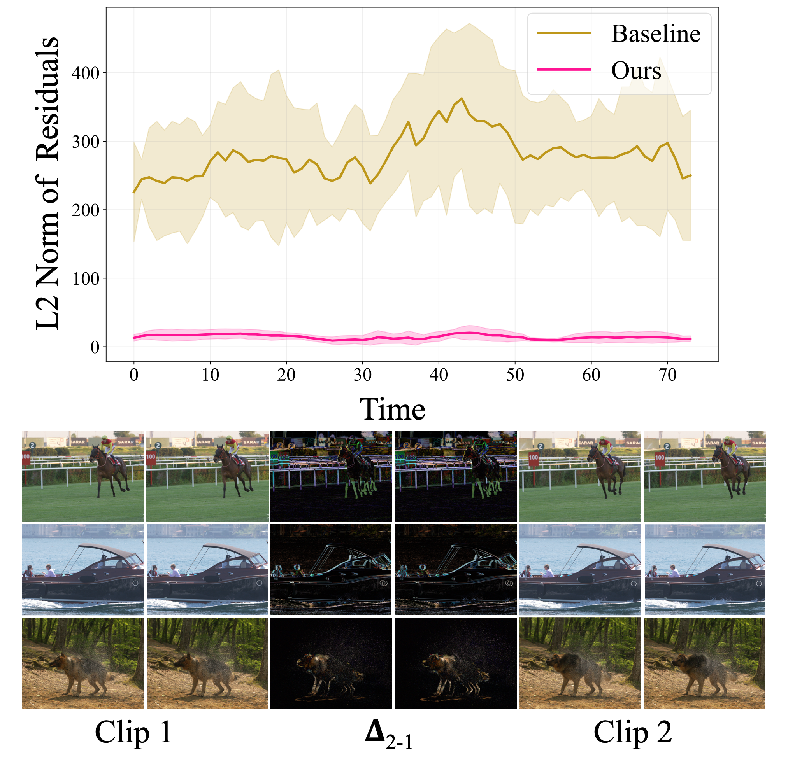

# TeCoNeRV: Leveraging Temporal Coherence for Compressible Neural Representations for Videos

**[Namitha Padmanabhan](https://namithap10.github.io/)** · **[Matthew Gwilliam](https://mgwillia.github.io/)** · **[Abhinav Shrivastava](http://www.cs.umd.edu/~abhinav/)**

University of Maryland, College Park

<a href='https://arxiv.org/abs/2602.16711'></a>
<a href='https://namithap10.github.io/teconerv/'></a>
<a href='https://huggingface.co/namithap/teconerv-models'></a>

This repository contains the official implementation for the paper "TeCoNeRV: Leveraging Temporal Coherence for Compressible Neural Representations for Videos". TeCoNeRV uses hypernetworks to predict implicit neural representation (INR) weights for video compression. A patch-tubelet decomposition enables hypernetworks to scale to high-resolution video prediction and additionally supports resolution-independent training. A temporal coherence objective encourages clip representations to vary smoothly with video content, enabling compact residual-based encoding of per-clip parameters.

<p align="center">
  
</p>


## Getting started

**Requirements:** Python 3.10+, PyTorch 1.13.0+, NumPy < 2.0

```bash
pip install torch==2.1.1 torchvision==0.16.1 torchaudio==2.1.1 --index-url https://download.pytorch.org/whl/cu121
pip install -r requirements.txt
```

Distributed training is supported via `torchrun`.

## Pretrained models

Please follow the link to [Hugging Face](https://huggingface.co/namithap/teconerv-models) to download our model weights.

```bash
git lfs install
git clone https://huggingface.co/namithap/teconerv-models
```

Copy the downloaded folders into `checkpoints/` in this repository. See [docs/models.md](docs/models.md) for further details.

## Data preparation

We use Kinetics-400 videos for training. UVG, HEVC, and MCL-JCV are used for evaluation. See [docs/datasets.md](docs/datasets.md) for setup instructions.

## Training

```bash
bash scripts/train/train_baseline.sh
bash scripts/train/train_patch_tubelet.sh
bash scripts/train/train_teconerv.sh
```

See [docs/training.md](docs/training.md) for full details on configs, resolution settings, and finetuning.

## Evaluation

```bash
bash scripts/eval/eval_baseline.sh
bash scripts/eval/eval_patch_tubelet.sh
bash scripts/eval/eval_teconerv.sh
bash scripts/eval/eval_teconerv_overlap.sh   # overlapped inference
```

Evaluation reports PSNR, MS-SSIM, bits per pixel, and encoding/decoding FPS using the compressed bitstream with quantization and arithmetic coding. Results are produced for direct encoding and residual encoding (`from_first`, `from_prev`). See [docs/evaluation.md](docs/evaluation.md) for how to reproduce numbers from the paper and adapt evaluation to other datasets.

## Documentation


|                                          |                                          |
| ---------------------------------------- | ---------------------------------------- |
| [docs/datasets.md](docs/datasets.md)     | Dataset setup and preprocessing          |
| [docs/models.md](docs/models.md)         | Pretrained checkpoints                   |
| [docs/training.md](docs/training.md)     | Training and finetuning                  |
| [docs/evaluation.md](docs/evaluation.md) | Evaluation and reproducing paper results |


## Citation

```bibtex
@article{padmanabhan2026teconerv,
  title={TeCoNeRV: Leveraging Temporal Coherence for Compressible Neural Representations for Videos},
  author={Padmanabhan, Namitha and Gwilliam, Matthew and Shrivastava, Abhinav},
  journal={arXiv preprint arXiv:2602.16711},
  year={2026}
}
```
